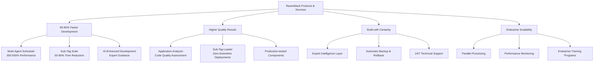

# Ravenblack Product & Service Portfolio Mind Map

## Complete Product & Service Architecture

```mermaid
mindmap
  root((Ravenblack Technical Services))
    Products
      AI Enhancement Platform
        Seaside.AI Platform
          Purpose
            RAG-powered AI assistant
            Expert intelligence layer
          Features
            Multi-collection knowledge bases
            Contextual AI responses
            Conversation history
            Real-time analytics
          Benefits
            Enhanced development experience
            Expert-guided assistance
            Bi-directional AI enhancement
        RB Application Analyzer
          Purpose
            AI-enhanced codebase analysis
            Predictive insights
          Features
            Automated code quality assessment
            Performance bottleneck identification
            Customization impact analysis
            Migration readiness evaluation
          Benefits
            Build with confidence
            Proactive issue detection
            Risk mitigation
        RB Dynamic Widgets
          Purpose
            Intelligent SmartView widget development
            AI-assisted widget management
          Features
            AI-powered template generation
            Automated API integration suggestions
            Performance optimization recommendations
            Cross-browser compatibility validation
          Benefits
            Smart widget development
            Native API integration
            Expert patterns integration
      Performance & Automation
        Ravenblack Multi-Agent Scheduler
          Purpose
            Eliminate automation bottlenecks
            Replace single serial queue with parallel agents
          Features
            Parallel Processing
            Scheduling Dashboard (Unified view of tasks)
            AI-optimized resource allocation
          Benefits
            Increases performance and scalability (300-500%)
            Ensures timely execution of critical processes
            Eliminates system bottlenecks
        Ravenblack Sub-Tag Loader (RBSL)
          Purpose
            Install/update WebReports sub-tags without restart
          Features
            Instant, thread-safe loading
            Centralized management interface
            Automatic backup and rollback
          Benefits
            Zero-downtime deployments
            Eliminates costly maintenance windows
            Reduces deployment risk
        Ravenblack Sub-Tag Suite (RBSS)
          Purpose
            Library of over 30 professional sub-tags
            Accelerate common development tasks
          Features
            Library components (Debugging, data management)
            Production-tested code patterns
            Comprehensive documentation
          Benefits
            Reduce development time by 50-60%
            Improves application reliability
            Accelerates developer productivity
        Performance Suite
          Purpose
            AI-driven continuous monitoring
            Intelligent optimization recommendations
          Features
            Automated performance baseline establishment
            Predictive scaling recommendations
            Resource optimization suggestions
            Automated issue resolution
          Benefits
            Zero surprises, maximum performance
            Expert intelligence layer
            Predictive optimization
    Services
      Content Intelligence Solution Development
        Purpose
          Expert consulting for building business applications
        Features
          Full development lifecycle support
          Expert consulting throughout complete lifecycle
          Packaging final solution into CSApp
        Benefits
          Turn complex requirements into robust solutions
          Custom Content Server applications
          Professional implementation
      Content Intelligence Audit & Review
        Purpose
          Optimize existing CI/WebReports applications
          Prepare for upgrades or cloud migrations
        Features
          Pre-upgrade audits
          Identify performance bottlenecks (Nested reports)
          Resolution of security issues (Hard-coded IDs)
          Cloud migration readiness assessments
        Benefits
          Risk mitigation and optimization
          Smooth Content Server transitions
          Performance improvement
      Content Intelligence Enablement and Training
        Purpose
          Quickly onboard teams on Content Intelligence capabilities
        Features
          Training for all skill levels (New users to developers)
          Courses based on original WebReports materials
          Customized training paths
          Developer-focused advanced programs
        Benefits
          Minimize learning curves
          Accelerate productive utilization
          Knowledge transfer and continuity
      Content Intelligence Support
        Purpose
          Support and maintenance for WebReport applications
          Lifeline when developer knowledge leaves
        Features
          Tracking and resolving bugs
          Fixing technical WebReports issues
          Ongoing maintenance
          Knowledge continuity services
        Benefits
          Ensure continuous operation
          Eliminate knowledge loss risks
          24/7 technical support
```

## Alternative Flowchart Structure

```mermaid
flowchart TD
    A[Ravenblack Technical Services] --> B[Products]
    A --> C[Services]
    
    B --> D[AI Enhancement Platform]
    B --> E[Performance & Automation]
    
    D --> F[Seaside.AI Platform]
    D --> G[RB Application Analyzer]
    D --> H[RB Dynamic Widgets]
    
    E --> I[Multi-Agent Scheduler]
    E --> J[Sub-Tag Loader RBSL]
    E --> K[Sub-Tag Suite RBSS]
    E --> L[Performance Suite]
    
    C --> M[Solution Development]
    C --> N[Audit & Review]
    C --> O[Training & Enablement]
    C --> P[Support Services]
    
    F --> F1[Expert Intelligence Layer]
    F --> F2[RAG-powered AI Assistant]
    F --> F3[Bi-directional Enhancement]
    
    I --> I1[Eliminate Bottlenecks]
    I --> I2[Parallel Processing]
    I --> I3[300-500% Performance Gain]
    
    J --> J1[Zero-Downtime Deployments]
    J --> J2[Thread-safe Loading]
    J --> J3[Automatic Rollback]
    
    K --> K1[30+ Professional Sub-tags]
    K --> K2[50-60% Time Reduction]
    K --> K3[Production-tested Components]
    
    M --> M1[Full-lifecycle Development]
    M --> M2[CSApp Packaging]
    M --> M3[Expert Consulting]
    
    N --> N1[Performance Optimization]
    N --> N2[Migration Preparation]
    N --> N3[Security Issue Resolution]
    
    O --> O1[All Skill Levels]
    O --> O2[WebReports Materials]
    O --> O3[Knowledge Transfer]
    
    P --> P1[Bug Resolution]
    P --> P2[Technical Support]
    P --> P3[Knowledge Continuity]
```

## Hierarchical Product Benefits Map

This Mermaid representation captures the complete hierarchical structure from your JPG files, showing the relationships between products, services, their purposes, features, and benefits in an interactive, navigable format.