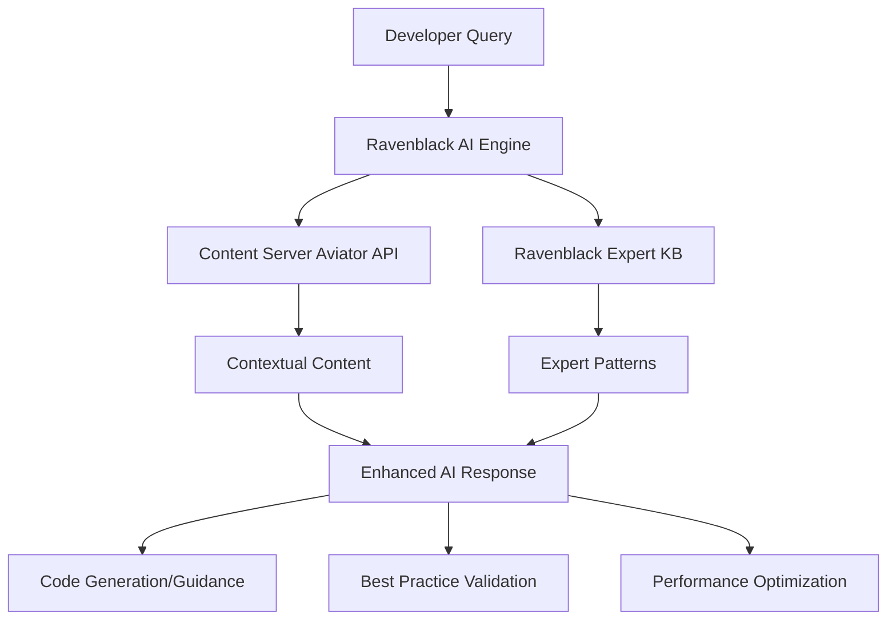

# Content Server REST API 2.0.2 - Deep Technical Integration Analysis

## Executive Summary

Analysis of OpenText Content Server REST API 2.0.2 reveals extensive opportunities for deep technical integration with Ravenblack's AI platform. The discovery of Content Server's built-in "Aviator" AI capabilities fundamentally changes our integration strategy from standalone AI to **AI enhancement architecture**.

**Key Finding**: Content Server 2.0.2+ includes native AI capabilities (`/v2/ai/context`) that provide the perfect foundation for Ravenblack's expert intelligence layer.

---

## Content Server AI Capabilities Analysis

### Aviator AI Context API (`/v2/ai/context`)

**Endpoint**: `POST /v2/ai/context`  
**Purpose**: AI-powered context search with permission checking  
**Capabilities**: 
- Semantic search through configured knowledge base
- Distance-based similarity matching (threshold parameter)
- Metadata filtering and context refinement
- Permission-aware results (respects Content Server security)

#### Technical Specifications:
```yaml
POST /v2/ai/context
Content-Type: application/x-www-form-urlencoded

Parameters:
  query: string          # Text to search for context
  threshold: integer     # Maximum distance for matches (default: 0.5)
  limit: integer         # Number of results to return (default: 10)  
  data: array[object]    # Metadata name/value pairs for filtering

Response:
  results: array
    - pageContext: string    # Matched content chunk
    - distance: integer      # Similarity score  
    - metadata: object       # Associated metadata
```

#### Strategic Implications:
- **Foundation for Enhancement**: Provides base AI context that Ravenblack can amplify
- **Permission Integration**: Built-in security model respects user access rights
- **Metadata Support**: Extensible filtering system for specialized queries
- **Scalable Architecture**: Designed to handle enterprise-level context searches

---

## Core Integration Architecture

### 1. **Bi-Directional AI Enhancement**



**Architecture Benefits:**
- **Contextual Relevance**: Leverages Content Server's understanding of user's specific environment
- **Expert Intelligence**: Adds 15 years of proven patterns and solutions
- **Security Integration**: Maintains Content Server's permission model throughout
- **Performance Optimization**: Combines generic context with specialized knowledge

### 2. **Native API Integration Points**

#### A. **WebReports Development Assistance**
**Primary APIs:**
- `/v1/nodes/{id}/output?format=webreport` - Execute WebReports
- `/v1/webreports/{nickname}` - Access by nickname
- `/v1/nodes/{id}/parameters` - Get parameter definitions
- `/v1/webreports/{nickname}/parameters` - WebReport-specific parameters

**Integration Opportunities:**
```javascript
// AI-Enhanced WebReport Development Flow
async function enhanceWebReportDevelopment(query) {
  // 1. Get contextual information from Content Server AI
  const context = await contentServer.post('/v2/ai/context', {
    query: query,
    threshold: 0.7,
    data: [{ type: 'webreport', workspace: userWorkspace }]
  });
  
  // 2. Enhance with Ravenblack expert knowledge
  const expertGuidance = await ravenblackAI.getExpertGuidance(query, context);
  
  // 3. Generate WebReport code with both context and expertise
  const webReportCode = await ravenblackAI.generateWebReport({
    context: context.results,
    expertPatterns: expertGuidance.patterns,
    userRequirements: query
  });
  
  // 4. Validate against Content Server parameters
  const nodeId = await createWebReportNode(webReportCode);
  const validation = await contentServer.get(`/v1/nodes/${nodeId}/parameters`);
  
  return {
    code: webReportCode,
    validation: validation,
    expertRecommendations: expertGuidance.recommendations
  };
}
```

#### B. **Node Management & Content Intelligence**
**Primary APIs:**
- `/v1/nodes` - Node CRUD operations
- `/v1/nodes/{id}/categories` - Category management
- `/v1/nodes/{id}/permissions` - Permission management
- `/v1/nodes/{id}/versions` - Version control

**AI Enhancement Opportunities:**
- **Intelligent Node Organization**: AI suggests optimal folder structures and categorization
- **Permission Optimization**: Expert guidance on permission best practices
- **Version Strategy**: AI recommends versioning approaches based on content type

#### C. **Authentication & Security Integration**
**Primary APIs:**
- `/v1/auth` - Authentication management
- `/v1/currentuser` - User context information

**Integration Strategy:**
```javascript
// Security-Aware AI Integration
class RavenblackSecurityIntegration {
  async authenticateAndEnhance(credentials) {
    // 1. Authenticate with Content Server
    const authToken = await contentServer.post('/v1/auth', credentials);
    
    // 2. Get user context and permissions
    const userContext = await contentServer.get('/v1/currentuser', {
      headers: { 'Authorization': `Bearer ${authToken}` }
    });
    
    // 3. Initialize Ravenblack AI with user's security context
    const aiSession = await ravenblackAI.initializeSecureSession({
      userContext,
      permissions: userContext.permissions,
      workspaceAccess: userContext.workspaces
    });
    
    return aiSession;
  }
}
```

---

## Advanced Integration Scenarios

### 1. **Smart Development Environment**

```javascript
// Integrated Development Assistant
class ContentServerDevAssistant {
  constructor(contentServerAPI, ravenblackAI) {
    this.cs = contentServerAPI;
    this.ai = ravenblackAI;
  }
  
  async assistDevelopment(userQuery) {
    // Get contextual information from user's actual environment
    const context = await this.cs.post('/v2/ai/context', {
      query: userQuery,
      data: [
        { workspace: this.cs.currentUser.workspace },
        { permissions: this.cs.currentUser.permissions }
      ]
    });
    
    // Enhance with expert intelligence
    const expertAnalysis = await this.ai.analyzeWithExpertise({
      query: userQuery,
      context: context.results,
      userEnvironment: {
        contentServerVersion: this.cs.version,
        installedModules: this.cs.modules,
        customizations: this.cs.customizations
      }
    });
    
    return {
      contextualRelevance: context.results,
      expertGuidance: expertAnalysis.recommendations,
      codeExamples: expertAnalysis.codePatterns,
      bestPractices: expertAnalysis.bestPractices,
      potentialIssues: expertAnalysis.warnings
    };
  }
}
```

### 2. **Automated Code Review & Optimization**

```javascript
// AI-Powered Code Analysis
async function analyzeWebReportCode(webReportNodeId) {
  // 1. Get WebReport content and parameters
  const webReportOutput = await contentServer.get(
    `/v1/nodes/${webReportNodeId}/output?format=webreport`
  );
  
  const parameters = await contentServer.get(
    `/v1/nodes/${webReportNodeId}/parameters`
  );
  
  // 2. Analyze with both Content Server AI and Ravenblack expertise
  const [contextAnalysis, expertAnalysis] = await Promise.all([
    contentServer.post('/v2/ai/context', {
      query: `analyze webreport performance optimization`,
      data: [{ nodeId: webReportNodeId, type: 'performance_analysis' }]
    }),
    
    ravenblackAI.analyzeCode({
      code: webReportOutput,
      parameters: parameters,
      analysisType: 'comprehensive_review'
    })
  ]);
  
  return {
    performanceOptimizations: expertAnalysis.optimizations,
    securityRecommendations: expertAnalysis.security,
    bestPracticeViolations: expertAnalysis.violations,
    contextualSuggestions: contextAnalysis.results
  };
}
```

### 3. **Intelligent Content Migration**

```javascript
// AI-Enhanced Migration Assistant
class MigrationAssistant {
  async analyzeMigrationPath(sourceNodes, targetEnvironment) {
    // 1. Get contextual information about source content
    const migrationContext = await Promise.all(
      sourceNodes.map(nodeId => 
        contentServer.post('/v2/ai/context', {
          query: `migration analysis for node ${nodeId}`,
          data: [{ nodeId, type: 'migration_analysis' }]
        })
      )
    );
    
    // 2. Expert analysis of migration complexity and risks
    const expertMigrationPlan = await ravenblackAI.createMigrationPlan({
      sourceAnalysis: migrationContext,
      targetEnvironment,
      migrationGoals: this.migrationGoals
    });
    
    // 3. Generate migration scripts and validation procedures
    return {
      migrationSteps: expertMigrationPlan.steps,
      riskAssessment: expertMigrationPlan.risks,
      validationProcedures: expertMigrationPlan.validation,
      rollbackPlan: expertMigrationPlan.rollback
    };
  }
}
```

---

## Performance & Scalability Considerations

### 1. **API Rate Limiting & Optimization**

```javascript
// Intelligent API Usage Management
class APIOptimizer {
  constructor() {
    this.requestQueue = new Map();
    this.cacheManager = new CacheManager();
  }
  
  async optimizeAIRequest(query, userContext) {
    // 1. Check cache for similar queries
    const cacheKey = this.generateCacheKey(query, userContext);
    const cached = await this.cacheManager.get(cacheKey);
    
    if (cached && !this.isStale(cached)) {
      return this.enhanceWithRecentExpertise(cached);
    }
    
    // 2. Batch multiple queries for efficiency
    const batchRequest = this.createBatchRequest([
      { endpoint: '/v2/ai/context', params: { query, ...userContext }},
      { endpoint: '/v1/currentuser', params: {} }
    ]);
    
    // 3. Execute with rate limiting
    const results = await this.executeWithRateLimit(batchRequest);
    
    // 4. Cache results with intelligent expiration
    await this.cacheManager.set(cacheKey, results, {
      ttl: this.calculateOptimalTTL(query),
      tags: ['ai_context', userContext.workspace]
    });
    
    return results;
  }
}
```

### 2. **Real-Time Collaboration Features**

```javascript
// Multi-User AI Collaboration
class CollaborativeAI {
  async enableTeamAssistance(teamMembers, projectContext) {
    // 1. Get team-wide context from Content Server
    const teamContext = await Promise.all(
      teamMembers.map(member =>
        contentServer.post('/v2/ai/context', {
          query: projectContext.goals,
          data: [{ userId: member.id, workspace: member.workspace }]
        })
      )
    );
    
    // 2. Create shared knowledge base with expert insights
    const sharedKnowledge = await ravenblackAI.createTeamKnowledgeBase({
      teamContext,
      projectRequirements: projectContext.requirements,
      expertPatterns: await this.getRelevantExpertPatterns(projectContext)
    });
    
    // 3. Enable real-time collaboration features
    return {
      sharedAssistant: new SharedAIAssistant(sharedKnowledge),
      collaborativeCodeReview: new CollaborativeReview(teamMembers),
      knowledgeSharing: new TeamKnowledgeManager(sharedKnowledge)
    };
  }
}
```

---

## Security & Compliance Integration

### 1. **Permission-Aware AI Responses**

```javascript
// Security-Integrated AI Architecture
class SecureAI {
  async getSecureResponse(query, userToken) {
    // 1. Validate user permissions through Content Server
    const userPermissions = await this.validateUserAccess(userToken);
    
    // 2. Filter AI responses based on actual permissions
    const contextRequest = {
      query,
      data: [
        { permissionLevel: userPermissions.level },
        { accessibleWorkspaces: userPermissions.workspaces },
        { restrictedContent: userPermissions.restrictions }
      ]
    };
    
    const context = await contentServer.post('/v2/ai/context', contextRequest);
    
    // 3. Enhance with permission-appropriate expert guidance
    const expertResponse = await ravenblackAI.getPermissionFilteredResponse({
      context: context.results,
      userPermissions,
      expertiseLevel: this.calculateExpertiseLevel(userPermissions)
    });
    
    return this.sanitizeResponse(expertResponse, userPermissions);
  }
}
```

### 2. **Audit Trail & Compliance**

```javascript
// Comprehensive Audit Integration
class ComplianceIntegration {
  async logAIInteraction(interaction, userContext) {
    const auditRecord = {
      timestamp: new Date().toISOString(),
      userId: userContext.userId,
      query: this.sanitizeForAudit(interaction.query),
      contextSources: interaction.contextSources,
      expertPatternsUsed: interaction.expertPatterns,
      responseType: interaction.responseType,
      complianceFlags: this.evaluateCompliance(interaction)
    };
    
    // Log to both Ravenblack and Content Server audit systems
    await Promise.all([
      contentServer.post('/v1/audit/log', auditRecord),
      ravenblackAI.logInteraction(auditRecord)
    ]);
    
    return auditRecord.id;
  }
}
```

---

## Implementation Roadmap

### Phase 1: Foundation Integration (Weeks 1-4)
1. **Basic Aviator API Integration**
   - Implement `/v2/ai/context` API calls
   - Create authentication integration with Content Server
   - Build basic request/response handling

2. **Security Framework**
   - Implement permission-aware AI responses
   - Create audit logging system
   - Build user context management

3. **Core Enhancement Engine**
   - Develop bi-directional AI architecture
   - Implement expert knowledge integration
   - Create response synthesis engine

### Phase 2: Advanced Features (Weeks 5-8)
1. **WebReports Intelligence**
   - AI-assisted WebReport generation
   - Parameter optimization suggestions
   - Performance analysis integration

2. **Node Management Enhancement**
   - Intelligent categorization suggestions
   - Permission optimization guidance
   - Version control strategy recommendations

3. **Collaboration Features**
   - Multi-user AI assistance
   - Shared knowledge base creation
   - Team-wide best practice enforcement

### Phase 3: Enterprise Features (Weeks 9-12)
1. **Performance Optimization**
   - Advanced caching strategies
   - Request batching and optimization
   - Load balancing for AI requests

2. **Analytics & Reporting**
   - AI usage analytics
   - Development productivity metrics
   - ROI measurement dashboard

3. **Custom Integration Points**
   - Customer-specific API integrations
   - Custom workflow automation
   - Specialized industry adaptations

---

## Technical Requirements

### Infrastructure Requirements:
- **Content Server Version**: 2.0.2+ (for Aviator AI support)
- **Authentication**: OAuth 2.0 / OTDS integration
- **API Rate Limits**: Configurable throttling for enterprise use
- **Caching Layer**: Redis or equivalent for response optimization
- **Monitoring**: Comprehensive logging and performance metrics

### Development Stack:
- **Backend**: Node.js/Express or Python/FastAPI
- **AI Processing**: Integration with Google Vertex AI (existing Seaside.AI)
- **Database**: PostgreSQL for audit/analytics, Redis for caching
- **Security**: JWT tokens, RBAC integration with Content Server
- **Monitoring**: Prometheus/Grafana for performance tracking

### API Integration Patterns:
```javascript
// Standardized Integration Pattern
class ContentServerIntegration {
  constructor(config) {
    this.baseURL = config.contentServerURL;
    this.apiKey = config.apiKey;
    this.rateLimiter = new RateLimiter(config.rateLimit);
    this.cache = new IntelligentCache(config.cacheConfig);
  }
  
  async enhancedAPICall(endpoint, params, enhancementType) {
    // 1. Rate limiting
    await this.rateLimiter.acquire();
    
    // 2. Intelligent caching
    const cacheKey = this.generateCacheKey(endpoint, params);
    const cached = await this.cache.get(cacheKey);
    if (cached) return cached;
    
    // 3. API call with error handling
    const response = await this.makeAPICall(endpoint, params);
    
    // 4. AI enhancement
    const enhanced = await this.enhanceResponse(response, enhancementType);
    
    // 5. Cache with intelligent TTL
    await this.cache.set(cacheKey, enhanced, this.calculateTTL(endpoint));
    
    return enhanced;
  }
}
```

---

## Competitive Advantages Through Integration

### 1. **Native Enhancement vs. Overlay Solutions**
- **Deep Integration**: Works within Content Server's existing architecture
- **Security Preservation**: Maintains all existing security and audit capabilities
- **Performance Optimization**: Leverages Content Server's caching and optimization
- **Seamless Workflow**: No separate tools or interfaces to learn

### 2. **Expert Intelligence Layer**
- **Contextual + Expert**: Combines Content Server's context with proven expertise
- **Specialized Knowledge**: 15 years of WebReports patterns and best practices
- **Continuous Learning**: AI improves through both user interaction and expert validation
- **Domain-Specific**: Purpose-built for Content Server rather than generic AI

### 3. **Partnership Enhancement**
- **OpenText Value**: Makes Content Server AI more valuable rather than competing
- **Customer Investment Protection**: Builds on existing AI capabilities
- **Ecosystem Strengthening**: Benefits the entire Content Server partner ecosystem
- **Future-Proof Architecture**: Designed to evolve with Content Server roadmap

---

## Conclusion

The discovery of Content Server's built-in Aviator AI capabilities transforms Ravenblack's technical strategy from standalone AI to **AI enhancement architecture**. This approach provides:

1. **Lower Risk**: Building on existing, supported capabilities
2. **Higher Value**: Expert intelligence layer that transforms generic AI
3. **Better Integration**: Native API integration with existing security model
4. **Stronger Partnership**: Complementary rather than competitive relationship

The comprehensive REST API provides the technical foundation for deep integration that delivers the "never develop alone" experience while amplifying existing Content Server investments.

**Next Steps**: 
1. Prototype basic Aviator AI integration
2. Develop enhanced context engine
3. Create demonstration of bi-directional AI enhancement
4. Validate technical architecture with OpenText

---

**Document Version**: 1.0  
**Date**: September 28, 2025  
**Classification**: Technical Architecture - Strategic