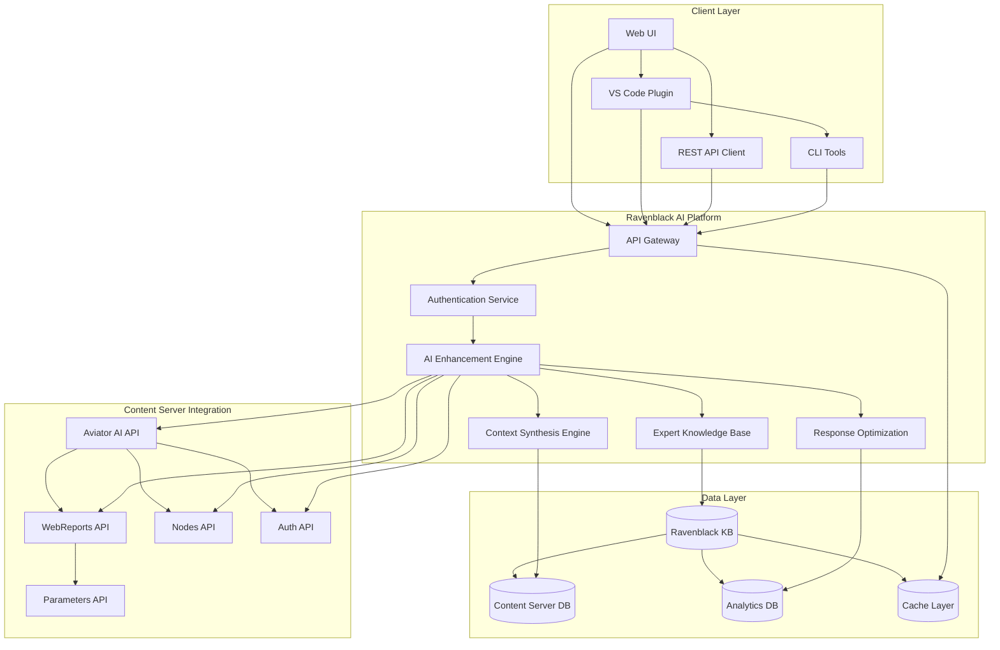

# Ravenblack-Content Server AI Integration Architecture

## Executive Summary

This document defines the technical architecture for integrating Ravenblack's AI platform with OpenText Content Server 2.0.2+ Aviator AI capabilities. The architecture implements an **AI Enhancement Strategy** that amplifies Content Server's existing AI rather than replacing it.

**Core Concept**: Ravenblack AI + Content Server Aviator AI = Expert Intelligence Layer

---

## High-Level Architecture

### System Overview



### Architecture Principles

1. **Enhancement Over Replacement**: Amplify Content Server AI, don't compete with it
2. **Security First**: Respect all Content Server permissions and audit requirements
3. **Performance Optimization**: Intelligent caching and request batching
4. **Scalable Design**: Enterprise-ready architecture with horizontal scaling
5. **API-Native**: Deep integration through official Content Server REST APIs

---

## Core Components

### 1. AI Enhancement Engine

**Purpose**: Synthesizes Content Server Aviator context with Ravenblack expertise

```javascript
class AIEnhancementEngine {
  async processQuery(userQuery, userContext) {
    const pipeline = [
      this.authenticateUser(userContext),
      this.getAviatorContext(userQuery, userContext),
      this.enhanceWithExpertise(userQuery),
      this.synthesizeResponse(),
      this.validateSecurity(),
      this.optimizeForUser()
    ];
    
    return await this.executePipeline(pipeline);
  }
  
  async getAviatorContext(query, context) {
    return await this.contentServerAPI.post('/v2/ai/context', {
      query: query,
      threshold: this.calculateOptimalThreshold(query),
      limit: this.calculateOptimalLimit(context),
      data: this.buildMetadataFilter(context)
    });
  }
  
  async enhanceWithExpertise(query) {
    return await this.expertKB.query({
      query: query,
      domainFilters: ['webreports', 'content_server', 'best_practices'],
      confidenceThreshold: 0.8,
      maxResults: 15
    });
  }
  
  async synthesizeResponse(aviatorContext, expertise) {
    return {
      contextualRelevance: aviatorContext.results,
      expertGuidance: expertise.recommendations,
      codeExamples: this.generateCodeExamples(expertise),
      warnings: this.identifyPotentialIssues(expertise),
      nextSteps: this.suggestNextActions(aviatorContext, expertise)
    };
  }
}
```

### 2. Context Synthesis Engine

**Purpose**: Intelligently combines multiple data sources for optimal AI responses

```javascript
class ContextSynthesisEngine {
  constructor() {
    this.contextSources = new Map([
      ['aviator', new AviatorContextSource()],
      ['expert', new ExpertKnowledgeSource()],
      ['user_history', new UserHistorySource()],
      ['project_context', new ProjectContextSource()]
    ]);
  }
  
  async synthesizeContext(query, userContext) {
    // 1. Parallel context gathering
    const contextPromises = Array.from(this.contextSources.entries()).map(
      ([source, provider]) => 
        provider.getContext(query, userContext)
          .then(result => ({ source, data: result }))
          .catch(error => ({ source, error }))
    );
    
    const contexts = await Promise.all(contextPromises);
    
    // 2. Context weighting and scoring
    const weightedContexts = contexts
      .filter(ctx => !ctx.error)
      .map(ctx => ({
        ...ctx,
        weight: this.calculateContextWeight(ctx, query),
        relevance: this.calculateRelevance(ctx, userContext)
      }));
    
    // 3. Intelligent synthesis
    return this.synthesizeWeightedContexts(weightedContexts);
  }
  
  calculateContextWeight(context, query) {
    const weights = {
      aviator: 0.4,    // High weight for Content Server native context
      expert: 0.35,    // High weight for proven expertise
      user_history: 0.15, // Medium weight for personalization
      project_context: 0.1  // Lower weight for broader context
    };
    
    return weights[context.source] * context.relevance;
  }
}
```

### 3. Expert Knowledge Base Interface

**Purpose**: Provides access to 15 years of Content Server expertise

```javascript
class ExpertKnowledgeBase {
  constructor() {
    this.knowledgeDomains = {
      webreports: new WebReportsExpertise(),
      subtags: new SubtagExpertise(),
      api_patterns: new APIPatternExpertise(),
      performance: new PerformanceExpertise(),
      security: new SecurityExpertise(),
      migration: new MigrationExpertise()
    };
  }
  
  async getExpertGuidance(query, context) {
    // 1. Domain classification
    const relevantDomains = await this.classifyQuery(query);
    
    // 2. Multi-domain expertise gathering
    const expertisePromises = relevantDomains.map(domain =>
      this.knowledgeDomains[domain].getGuidance(query, context)
    );
    
    const domainExpertise = await Promise.all(expertisePromises);
    
    // 3. Cross-domain synthesis
    return this.synthesizeDomainExpertise(domainExpertise);
  }
  
  async classifyQuery(query) {
    const classifications = await Promise.all([
      this.isWebReportsQuery(query),
      this.isPerformanceQuery(query),
      this.isSecurityQuery(query),
      this.isAPIQuery(query),
      this.isMigrationQuery(query)
    ]);
    
    return classifications
      .map((confidence, index) => ({ 
        domain: Object.keys(this.knowledgeDomains)[index],
        confidence 
      }))
      .filter(item => item.confidence > 0.3)
      .sort((a, b) => b.confidence - a.confidence)
      .map(item => item.domain);
  }
}
```

---

## API Integration Layer

### 1. Content Server API Client

**Purpose**: Standardized interface for all Content Server API interactions

```javascript
class ContentServerAPIClient {
  constructor(config) {
    this.baseURL = config.contentServerURL;
    this.rateLimiter = new SmartRateLimiter(config.rateLimit);
    this.cache = new IntelligentCache(config.cacheConfig);
    this.circuitBreaker = new CircuitBreaker(config.resilience);
  }
  
  async enhancedAPICall(endpoint, params, options = {}) {
    const cacheKey = this.generateCacheKey(endpoint, params);
    
    // 1. Check intelligent cache
    if (!options.skipCache) {
      const cached = await this.cache.get(cacheKey);
      if (cached && this.isCacheValid(cached, options)) {
        return this.addCacheMetadata(cached);
      }
    }
    
    // 2. Rate limiting with priority
    await this.rateLimiter.acquire(options.priority || 'normal');
    
    // 3. Circuit breaker protection
    return await this.circuitBreaker.execute(async () => {
      const response = await this.makeAPICall(endpoint, params, options);
      
      // 4. Intelligent caching with TTL optimization
      if (this.shouldCache(endpoint, response)) {
        const ttl = this.calculateOptimalTTL(endpoint, response.data);
        await this.cache.set(cacheKey, response, ttl);
      }
      
      return response;
    });
  }
  
  // Specialized methods for key integrations
  async getAviatorContext(query, userContext, options = {}) {
    return this.enhancedAPICall('/v2/ai/context', {
      query: query,
      threshold: options.threshold || 0.5,
      limit: options.limit || 10,
      data: this.buildContextMetadata(userContext)
    }, { 
      priority: 'high',
      cacheStrategy: 'smart',
      timeout: 30000
    });
  }
  
  async executeWebReport(nodeId, parameters = {}) {
    return this.enhancedAPICall(`/v1/nodes/${nodeId}/output`, {
      format: 'webreport',
      ...parameters
    }, {
      priority: 'high',
      timeout: 60000,
      retryAttempts: 3
    });
  }
  
  async getWebReportParameters(nodeId) {
    return this.enhancedAPICall(`/v1/nodes/${nodeId}/parameters`, {}, {
      cacheStrategy: 'aggressive',
      cacheTTL: 3600000 // 1 hour
    });
  }
}
```

### 2. Authentication & Security Layer

**Purpose**: Secure integration with Content Server authentication

```javascript
class SecurityIntegration {
  constructor(config) {
    this.authProvider = new ContentServerAuthProvider(config);
    this.permissionManager = new PermissionManager();
    this.auditLogger = new ComplianceAuditLogger(config);
  }
  
  async authenticateUser(credentials) {
    // 1. Authenticate with Content Server
    const authResponse = await this.authProvider.authenticate(credentials);
    
    // 2. Get user permissions and context
    const userPermissions = await this.permissionManager.getUserPermissions(
      authResponse.token
    );
    
    // 3. Create secure session context
    const sessionContext = {
      userId: authResponse.user.id,
      token: authResponse.token,
      permissions: userPermissions,
      workspace: userPermissions.defaultWorkspace,
      securityLevel: this.calculateSecurityLevel(userPermissions)
    };
    
    // 4. Initialize AI session with security constraints
    const aiSession = await this.initializeSecureAISession(sessionContext);
    
    return {
      sessionContext,
      aiSession,
      expiresAt: authResponse.expiresAt
    };
  }
  
  async validateAIResponse(response, userContext) {
    // 1. Content filtering based on permissions
    const filteredResponse = await this.filterByPermissions(
      response, 
      userContext.permissions
    );
    
    // 2. Security validation
    const securityValidation = await this.validateSecurity(
      filteredResponse,
      userContext.securityLevel
    );
    
    if (!securityValidation.passed) {
      await this.auditLogger.logSecurityEvent({
        type: 'RESPONSE_FILTERED',
        userId: userContext.userId,
        reason: securityValidation.reason,
        timestamp: new Date()
      });
      
      return this.createSafeResponse(securityValidation.safeContent);
    }
    
    return filteredResponse;
  }
}
```

---

## Performance & Scalability Architecture

### 1. Intelligent Caching Strategy

```javascript
class IntelligentCache {
  constructor(config) {
    this.redis = new Redis(config.redis);
    this.localCache = new LRUCache(config.local);
    this.analytics = new CacheAnalytics();
  }
  
  async get(key) {
    // 1. Try local cache first (fastest)
    let cached = this.localCache.get(key);
    if (cached && this.isValid(cached)) {
      this.analytics.recordHit('local', key);
      return cached.data;
    }
    
    // 2. Try distributed cache (Redis)
    cached = await this.redis.get(key);
    if (cached) {
      const data = JSON.parse(cached);
      if (this.isValid(data)) {
        // Promote to local cache
        this.localCache.set(key, data);
        this.analytics.recordHit('distributed', key);
        return data.data;
      }
    }
    
    this.analytics.recordMiss(key);
    return null;
  }
  
  async set(key, data, options = {}) {
    const cacheItem = {
      data: data,
      timestamp: Date.now(),
      ttl: options.ttl || this.calculateDefaultTTL(key),
      metadata: options.metadata || {}
    };
    
    // 1. Always cache locally for immediate access
    this.localCache.set(key, cacheItem);
    
    // 2. Cache in Redis for distributed access
    await this.redis.setex(
      key, 
      cacheItem.ttl / 1000, 
      JSON.stringify(cacheItem)
    );
    
    // 3. Record analytics
    this.analytics.recordSet(key, cacheItem.ttl);
  }
  
  calculateDefaultTTL(key) {
    const ttlRules = {
      'ai_context_': 300000,        // 5 minutes
      'webreport_params_': 3600000, // 1 hour
      'user_permissions_': 1800000, // 30 minutes
      'expert_guidance_': 1800000   // 30 minutes
    };
    
    for (const [prefix, ttl] of Object.entries(ttlRules)) {
      if (key.startsWith(prefix)) return ttl;
    }
    
    return 600000; // 10 minutes default
  }
}
```

### 2. Request Optimization Engine

```javascript
class RequestOptimizationEngine {
  constructor() {
    this.batchProcessor = new BatchProcessor();
    this.requestAnalyzer = new RequestAnalyzer();
    this.adaptiveThrottling = new AdaptiveThrottling();
  }
  
  async optimizeRequest(request, context) {
    // 1. Analyze request pattern
    const analysis = await this.requestAnalyzer.analyze(request, context);
    
    // 2. Determine optimization strategy
    if (analysis.batchable) {
      return this.batchProcessor.addToBatch(request, analysis.batchKey);
    }
    
    if (analysis.cacheable) {
      return this.executeCachedRequest(request, analysis.cacheStrategy);
    }
    
    if (analysis.priority === 'high') {
      return this.executeHighPriorityRequest(request);
    }
    
    // 3. Standard execution with adaptive throttling
    await this.adaptiveThrottling.acquire(analysis.estimatedLoad);
    return this.executeStandardRequest(request);
  }
  
  async executeCachedRequest(request, strategy) {
    const cacheKey = this.generateCacheKey(request);
    const cached = await this.cache.get(cacheKey);
    
    if (cached && this.validateCache(cached, strategy)) {
      return cached;
    }
    
    const response = await this.executeRequest(request);
    await this.cache.set(cacheKey, response, strategy.ttl);
    
    return response;
  }
}
```

---

## Integration Patterns

### 1. WebReports AI Enhancement Pattern

```javascript
class WebReportsAIEnhancement {
  async enhanceWebReportDevelopment(query, userContext) {
    // Phase 1: Context Gathering
    const [aviatorContext, expertContext, userHistory] = await Promise.all([
      this.contentServer.getAviatorContext(query, {
        data: [
          { type: 'webreport' },
          { workspace: userContext.workspace },
          { userId: userContext.userId }
        ]
      }),
      
      this.expertKB.getWebReportsGuidance(query),
      
      this.userHistory.getRelevantHistory(userContext.userId, 'webreport')
    ]);
    
    // Phase 2: Intelligent Analysis
    const analysis = await this.analyzeRequirements({
      query,
      aviatorResults: aviatorContext.results,
      expertPatterns: expertContext.patterns,
      userPreferences: userHistory.preferences
    });
    
    // Phase 3: Code Generation
    const webReportCode = await this.generateWebReport({
      requirements: analysis.requirements,
      bestPractices: expertContext.bestPractices,
      securityConstraints: userContext.securityConstraints,
      performanceTargets: analysis.performanceTargets
    });
    
    // Phase 4: Validation & Optimization
    const validation = await this.validateWebReport(webReportCode, userContext);
    
    return {
      code: webReportCode,
      validation: validation,
      recommendations: analysis.recommendations,
      nextSteps: this.generateNextSteps(analysis),
      learningPoints: expertContext.learningPoints
    };
  }
}
```

### 2. Real-Time Collaboration Pattern

```javascript
class CollaborativeAI {
  constructor() {
    this.sessionManager = new SessionManager();
    this.collaborationEngine = new CollaborationEngine();
    this.knowledgeSync = new KnowledgeSync();
  }
  
  async enableTeamCollaboration(teamId, projectContext) {
    // 1. Initialize team session
    const teamSession = await this.sessionManager.createTeamSession({
      teamId,
      projectContext,
      collaborationLevel: 'full'
    });
    
    // 2. Create shared context
    const sharedContext = await this.buildSharedContext(teamSession);
    
    // 3. Enable real-time features
    const collaboration = await this.collaborationEngine.initialize({
      session: teamSession,
      context: sharedContext,
      features: [
        'real_time_suggestions',
        'collaborative_code_review',
        'shared_knowledge_base',
        'team_learning'
      ]
    });
    
    // 4. Set up knowledge synchronization
    await this.knowledgeSync.enableTeamSync(teamSession.id);
    
    return collaboration;
  }
  
  async processCollaborativeQuery(query, teamContext) {
    // 1. Get team-wide context
    const teamMembers = await this.sessionManager.getActiveMembers(teamContext.sessionId);
    
    const teamContexts = await Promise.all(
      teamMembers.map(member => 
        this.contentServer.getAviatorContext(query, {
          userId: member.id,
          workspace: member.workspace,
          data: [{ team: teamContext.teamId }]
        })
      )
    );
    
    // 2. Synthesize team knowledge
    const teamKnowledge = await this.synthesizeTeamKnowledge(teamContexts);
    
    // 3. Generate collaborative response
    const response = await this.generateCollaborativeResponse({
      query,
      teamKnowledge,
      expertGuidance: await this.expertKB.getGuidance(query),
      teamPreferences: teamContext.preferences
    });
    
    // 4. Update shared knowledge base
    await this.updateSharedKnowledge(teamContext.sessionId, response);
    
    return response;
  }
}
```

---

## Monitoring & Analytics Architecture

### 1. Performance Monitoring

```javascript
class PerformanceMonitor {
  constructor() {
    this.metrics = new MetricsCollector();
    this.alerting = new AlertingSystem();
    this.analytics = new AnalyticsEngine();
  }
  
  async monitorAPICall(endpoint, duration, success, metadata) {
    // 1. Record basic metrics
    this.metrics.recordLatency(endpoint, duration);
    this.metrics.recordSuccess(endpoint, success);
    this.metrics.recordThroughput(endpoint);
    
    // 2. Advanced analytics
    if (duration > this.getThreshold(endpoint)) {
      await this.analyzeSlowRequest(endpoint, duration, metadata);
    }
    
    // 3. Pattern detection
    await this.detectAnomalies(endpoint, { duration, success, metadata });
    
    // 4. Proactive optimization
    if (this.shouldOptimize(endpoint)) {
      await this.triggerOptimization(endpoint);
    }
  }
  
  async generatePerformanceReport(timeRange) {
    const metrics = await this.analytics.aggregateMetrics(timeRange);
    
    return {
      summary: {
        totalRequests: metrics.totalRequests,
        averageLatency: metrics.averageLatency,
        successRate: metrics.successRate,
        cacheHitRate: metrics.cacheHitRate
      },
      
      endpoints: metrics.endpoints.map(ep => ({
        path: ep.path,
        performance: this.analyzeEndpointPerformance(ep),
        recommendations: this.generateOptimizationRecommendations(ep)
      })),
      
      insights: await this.generatePerformanceInsights(metrics),
      
      alerts: await this.getActiveAlerts(),
      
      optimizations: await this.suggestOptimizations(metrics)
    };
  }
}
```

### 2. Usage Analytics & ROI Tracking

```javascript
class UsageAnalytics {
  async trackDevelopmentEfficiency(userId, activity) {
    const efficiency = {
      userId,
      activity: activity.type,
      timeSpent: activity.duration,
      aiAssistanceUsed: activity.aiInteractions.length,
      codeGenerated: activity.codeMetrics.linesGenerated,
      issuesAvoided: activity.validationResults.issuesPrevented,
      timestamp: new Date()
    };
    
    // 1. Store detailed metrics
    await this.analytics.recordEfficiency(efficiency);
    
    // 2. Update user productivity score
    await this.updateProductivityScore(userId, efficiency);
    
    // 3. Generate insights
    const insights = await this.generateEfficiencyInsights(userId, efficiency);
    
    return insights;
  }
  
  async calculateROI(organizationId, timeframe) {
    // 1. Gather cost data
    const costs = await this.calculateCosts(organizationId, timeframe);
    
    // 2. Gather benefit data
    const benefits = await this.calculateBenefits(organizationId, timeframe);
    
    // 3. Calculate ROI metrics
    const roi = {
      timeReduction: benefits.timeSaved / costs.baselineDevelopmentTime,
      costSavings: benefits.costSavings - costs.platformCosts,
      productivityGain: benefits.productivityIncrease,
      qualityImprovement: benefits.qualityMetrics,
      
      roi: (benefits.totalValue - costs.totalCosts) / costs.totalCosts * 100,
      paybackPeriod: costs.totalCosts / (benefits.monthlySavings || 1)
    };
    
    return {
      roi,
      breakdown: {
        costs: costs.breakdown,
        benefits: benefits.breakdown
      },
      trends: await this.getROITrends(organizationId, timeframe),
      projections: await this.projectFutureROI(organizationId, roi)
    };
  }
}
```

---

## Deployment & Operations

### 1. Container Architecture

```dockerfile
# Ravenblack AI Platform - Main Service
FROM node:18-alpine AS base

WORKDIR /app

# Dependencies
COPY package*.json ./
RUN npm ci --only=production

# Application code
COPY src/ ./src/
COPY config/ ./config/

# Health checks and monitoring
HEALTHCHECK --interval=30s --timeout=10s --start-period=5s --retries=3 \
  CMD node src/healthcheck.js

# Security hardening
RUN addgroup -g 1001 -S nodejs && \
    adduser -S ravenblack -u 1001 && \
    chown -R ravenblack:nodejs /app
USER ravenblack

EXPOSE 3000

CMD ["node", "src/server.js"]
```

```yaml
# Kubernetes Deployment
apiVersion: apps/v1
kind: Deployment
metadata:
  name: ravenblack-ai-platform
spec:
  replicas: 3
  selector:
    matchLabels:
      app: ravenblack-ai
  template:
    metadata:
      labels:
        app: ravenblack-ai
    spec:
      containers:
      - name: ravenblack-ai
        image: ravenblack/ai-platform:latest
        ports:
        - containerPort: 3000
        env:
        - name: CONTENT_SERVER_URL
          valueFrom:
            configMapKeyRef:
              name: ravenblack-config
              key: content-server-url
        - name: EXPERT_KB_URL
          valueFrom:
            configMapKeyRef:
              name: ravenblack-config
              key: expert-kb-url
        resources:
          requests:
            memory: "512Mi"
            cpu: "500m"
          limits:
            memory: "1Gi"
            cpu: "1000m"
        livenessProbe:
          httpGet:
            path: /health
            port: 3000
          initialDelaySeconds: 30
          periodSeconds: 10
        readinessProbe:
          httpGet:
            path: /ready
            port: 3000
          initialDelaySeconds: 5
          periodSeconds: 5
```

### 2. Configuration Management

```javascript
// config/production.js
module.exports = {
  contentServer: {
    baseURL: process.env.CONTENT_SERVER_URL,
    apiVersion: 'v2',
    timeout: 30000,
    retries: 3,
    circuitBreaker: {
      threshold: 50,
      timeout: 60000,
      resetTimeout: 30000
    }
  },
  
  ai: {
    expertKB: {
      url: process.env.EXPERT_KB_URL,
      timeout: 15000,
      cacheStrategy: 'aggressive'
    },
    
    enhancement: {
      contextWeight: 0.4,
      expertWeight: 0.35,
      historyWeight: 0.15,
      projectWeight: 0.1
    }
  },
  
  performance: {
    cache: {
      redis: {
        host: process.env.REDIS_HOST,
        port: process.env.REDIS_PORT,
        ttl: 300000
      },
      local: {
        max: 10000,
        ttl: 60000
      }
    },
    
    rateLimiting: {
      windowMs: 60000,
      max: 1000,
      skipSuccessfulRequests: true
    }
  },
  
  monitoring: {
    metrics: {
      enabled: true,
      interval: 10000
    },
    
    alerting: {
      enabled: true,
      thresholds: {
        latency: 5000,
        errorRate: 0.05,
        availability: 0.99
      }
    }
  }
};
```

---

## Security & Compliance

### 1. Security Architecture

```javascript
class SecurityFramework {
  constructor() {
    this.encryption = new EncryptionService();
    this.tokenManager = new TokenManager();
    this.auditLogger = new AuditLogger();
    this.threatDetection = new ThreatDetection();
  }
  
  async secureRequest(request, userContext) {
    // 1. Request validation
    const validation = await this.validateRequest(request);
    if (!validation.valid) {
      await this.auditLogger.logSecurityEvent('INVALID_REQUEST', {
        userId: userContext.userId,
        reason: validation.reason,
        request: this.sanitizeForLogging(request)
      });
      throw new SecurityError(validation.reason);
    }
    
    // 2. Token validation
    const tokenValidation = await this.tokenManager.validate(userContext.token);
    if (!tokenValidation.valid) {
      throw new AuthenticationError('Invalid or expired token');
    }
    
    // 3. Permission check
    const hasPermission = await this.checkPermissions(
      userContext.userId,
      request.resource,
      request.action
    );
    
    if (!hasPermission) {
      await this.auditLogger.logSecurityEvent('PERMISSION_DENIED', {
        userId: userContext.userId,
        resource: request.resource,
        action: request.action
      });
      throw new AuthorizationError('Insufficient permissions');
    }
    
    // 4. Threat detection
    await this.threatDetection.analyzeRequest(request, userContext);
    
    return { validated: true, context: userContext };
  }
}
```

### 2. Compliance Framework

```javascript
class ComplianceFramework {
  constructor() {
    this.dataClassification = new DataClassificationEngine();
    this.retentionManager = new DataRetentionManager();
    this.privacyManager = new PrivacyManager();
  }
  
  async processComplianceRequirement(data, userContext, regulation) {
    // 1. Data classification
    const classification = await this.dataClassification.classify(data);
    
    // 2. Apply regulation-specific rules
    const complianceRules = this.getComplianceRules(regulation);
    const processedData = await this.applyComplianceRules(
      data, 
      classification, 
      complianceRules
    );
    
    // 3. Set retention policy
    await this.retentionManager.setRetentionPolicy(
      processedData,
      classification,
      regulation
    );
    
    // 4. Privacy protection
    if (this.containsPersonalData(classification)) {
      await this.privacyManager.applyPrivacyProtection(
        processedData,
        regulation
      );
    }
    
    return {
      processedData,
      classification,
      complianceMetadata: {
        regulation,
        appliedRules: complianceRules.applied,
        retentionPeriod: classification.retentionPeriod,
        privacyLevel: classification.privacyLevel
      }
    };
  }
}
```

---

## Conclusion

This architecture provides a comprehensive foundation for integrating Ravenblack's AI platform with Content Server's Aviator AI capabilities. The design emphasizes:

1. **Enhancement Over Competition**: Building on Content Server's existing AI investment
2. **Security First**: Comprehensive security and compliance framework
3. **Performance Optimization**: Intelligent caching, request optimization, and scalability
4. **Operational Excellence**: Full monitoring, analytics, and deployment automation

**Next Steps**:
1. Implement core AI Enhancement Engine
2. Build Content Server API integration layer
3. Deploy pilot environment for validation
4. Conduct performance and security testing
5. Begin phased customer rollout

---

**Document Version**: 1.0  
**Date**: September 28, 2025  
**Classification**: Technical Architecture - Implementation Ready